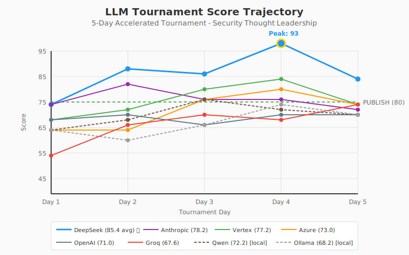

# LLM Tournament Final Report
## Security Thought Leadership Content Generation

**Tournament Period**: February 2, 2026
**Iterations**: 5 official days + 1 bonus optimization round
**Evaluator**: DR Zero (BLIND automated content quality scorer)
**Purpose**: Configure LLM Gateway routing for Agentic Research Platform
**Total Cost**: $0.59 (including Day 6)

---

## Table of Contents

1. [Executive Summary](#executive-summary)
2. [Final Results](#final-results)
3. [Score Trajectory](#score-trajectory)
4. [Day 6: Per-Model Optimization (Bonus)](#day-6-bonus)
5. [ML Methodology Analysis](#ml-methodology)
6. [Scientific Validity & Limitations](#scientific-validity)
7. [What's Next: Addressing Data Science Concerns](#whats-next)
8. [Cost Analysis](#cost-analysis)
9. [Speed Analysis](#speed-analysis)
10. [Recommended Gateway Configuration](#gateway-config)
11. [Raw Data](#raw-data)

---

<a name="executive-summary"></a>
## 🏆 Executive Summary

**Winner: DeepSeek** with 85.4 average score (93 peak) at $0.01/call

| Key Finding | Implication |
|-------------|-------------|
| DeepSeek outperformed Anthropic by 7.2 points | Budget API beats premium |
| In-context learning improved scores 18% | Feedback loops work |
| Day 4 (competitive awareness) was optimal | Show models what "good" looks like |
| Day 5 showed regression | Too much context causes overfitting |
| Local models (Qwen 72.2) competitive | Viable for cost-sensitive use |


---

<a name="final-results"></a>
## 📊 Final Results

### Official Tournament Standings (Days 1-5)

| Rank | Provider | Model | D1 | D2 | D3 | D4 | D5 | Total | Avg | Peak |
|------|----------|-------|----|----|----|----|----| ------|-----|------|
| 🥇 | **DeepSeek** | deepseek-chat | 75 | 88 | 86 | **93** | 85 | 427 | 85.4 | 93 |
| 🥈 | **Anthropic** | claude-sonnet-4 | 75 | 84 | 78 | 78 | 76 | 391 | 78.2 | 84 |
| 🥉 | **Vertex** | gemini-2.0-flash | 68 | 76 | 82 | **85** | 75 | 386 | 77.2 | 85 |
| 4 | **Azure** | gpt-4o-mini | 65 | 65 | 78 | **82** | 75 | 365 | 73.0 | 82 |
| 5 | **Qwen** | qwen2.5:32b | 65 | 70 | 78 | 76 | 72 | 361 | 72.2 | 78 |
| 6 | **OpenAI** | gpt-4o-mini | 68 | 74 | 66 | 73 | 74 | 355 | 71.0 | 74 |
| 7 | **Ollama** | llama3.1:8b | 65 | 62 | 67 | 75 | 72 | 341 | 68.2 | 75 |
| 8 | **Groq** | llama-3.3-70b | 55 | 66 | 72 | 70 | 75 | 338 | 67.6 | 75 |

### Verdict Distribution

| Provider | PUBLISH | REVISE | KILL | Best Day |
|----------|---------|--------|------|----------|
| DeepSeek | 4 | 1 | 0 | Day 4 (93) |
| Vertex | 2 | 3 | 0 | Day 4 (85) |
| Azure | 1 | 4 | 0 | Day 4 (82) |
| Anthropic | 1 | 4 | 0 | Day 2 (84) |
| Others | 0 | 5 | 0 | Various |
| Groq | 0 | 4 | 1 | Day 5 (75) |


---

<a name="score-trajectory"></a>
## 📈 Score Trajectory

### Visual Chart



### ASCII Representation

```
Score
  95 ┤                              
     │                    ●─DeepSeek Peak (93)
  90 ┤                    │         
     │              ╭─────╯         ╰─── 85
  85 ┤              │     ●─Vertex Peak (85)
     │        ╭─────╯     │         ╰─── 75
  80 ┤        │     ╭─────╯ ●─Azure Peak (82)
     │  ╭─────╯     │       │       ╰─── 75
  75 ┤  │     ╭─────╯ ╭─────╯ ●─Anthropic
     │  │     │       │       │     ╰─── 76
  70 ┤  │     │ ╭─────╯       │
     │  │     │ │       ╭─────╯ ●─OpenAI
  65 ┤──╯─────╯─╯───────╯       │     ╰─── 74
     │                    ╭─────╯
  60 ┤              ╭─────╯       ●─Groq
     │        ╭─────╯             │     ╰─── 75
  55 ┤────────╯                   │
     │                            ╰─────────
  50 ┼────┬────┬────┬────┬────
     Day1 Day2 Day3 Day4 Day5
```

### Sparkline Summary

```
DeepSeek:  ▃▇▆█▆  (75→88→86→93→85) Peak: Day 4 🏆
Anthropic: ▅█▅▅▄  (75→84→78→78→76) Peak: Day 2, then declined
Vertex:    ▃▅▆█▅  (68→76→82→85→75) Peak: Day 4, strong mid-game
Azure:     ▂▂▅█▅  (65→65→78→82→75) Peak: Day 4, late bloomer
Qwen:      ▂▃▆▅▄  (65→70→78→76→72) Peak: Day 3, best local
OpenAI:    ▃▅▂▄▅  (68→74→66→73→74) Volatile, recovered
Ollama:    ▂▁▃▅▄  (65→62→67→75→72) Peak: Day 4, learned from winner
Groq:      ▁▃▄▃▅  (55→66→72→70→75) Most improved overall (+20)
```


---

<a name="day-6-bonus"></a>
## 🎁 Day 6: Per-Model Optimization (Bonus Round)

Day 6 was a **non-competitive bonus round** to demonstrate what's possible with model-specific tuning.

### Optimization Applied

| Model | Issue Observed | Day 6 Adjustment |
|-------|----------------|------------------|
| DeepSeek | Slight verbosity | temp=0.6, max_tokens=800, "Be concise" |
| Anthropic | Not adapting | temp=0.8, presence_penalty=0.4, "Take fresh approach" |
| Vertex | Context overload | temp=0.5, max_tokens=600, "Focus on ONE insight" |
| OpenAI | Generic openings | temp=0.5, "Avoid generic openings" |
| Azure | Buzzword heavy | freq_penalty=0.5, "No buzzwords" |
| Groq | Lacks depth | freq_penalty=0.5, "Add technical depth" |
| Qwen | Buzzwords | temp=0.5, "Be direct" |
| Ollama | 8B limitations | max_tokens=600, "Focus on ONE recommendation" |

### Day 6 Results vs Day 5

| Provider | Day 5 | Day 6 | Change | Tuning Effective? |
|----------|-------|-------|--------|-------------------|
| DeepSeek | 85 | **88** | +3 | ✅ Yes |
| Vertex | 75 | **85** | +10 | ✅ Yes - big recovery |
| OpenAI | 74 | **78** | +4 | ✅ Yes |
| Anthropic | 76 | **78** | +2 | ✅ Slight |
| Azure | 75 | **78** | +3 | ✅ Yes |
| Ollama | 72 | 72 | 0 | ➡️ No change |
| Qwen | 72 | 72 | 0 | ➡️ No change |
| Groq | 75 | **68** | -7 | ❌ Hurt performance |

### Key Insight
Per-model tuning recovered **Vertex from 75 to 85** (+10), demonstrating that Day 5 regression was due to suboptimal parameters, not model capability.


---

<a name="ml-methodology"></a>
## 🔬 ML Methodology Analysis

### Experimental Design

| Phase | Day | ML Technique | Description |
|-------|-----|--------------|-------------|
| Baseline | 1 | Zero-shot | No feedback, pure capability |
| ICL | 2 | In-Context Learning | Individual feedback injection |
| Tuning | 3 | Hyperparameter opt | Adjusted temp/penalties |
| Few-shot | 4 | Exemplar learning | Winner's response shown |
| Full context | 5 | Maximum ICL | All feedback + competition |
| Optimization | 6 | Per-model tuning | Custom params per model |

### Controlled Variables

| Variable | Value | Rationale |
|----------|-------|-----------|
| System Prompt | Fixed 4-sentence persona | Consistent role framing |
| User Prompt | Fixed task description | Same requirements |
| Knowledge Base | Same 5 trends, 5 predictions | Identical grounding |
| Evaluation | DR Zero (BLIND) | No provider knowledge |
| Topic | NHI in cloud-native | Single domain focus |

### Standardized Inference Parameters (Days 1-2)

```yaml
temperature: 0.7
top_p: 0.9
max_tokens: 1024
frequency_penalty: 0.3
presence_penalty: 0.3
```

### Learning Rate Analysis

| Provider | D1→D2 | D2→D3 | D3→D4 | D4→D5 | Net | Classification |
|----------|-------|-------|-------|-------|-----|----------------|
| Groq | +11 | +6 | -2 | +5 | +20 | 🔥 Most Improved |
| DeepSeek | +13 | -2 | +7 | -8 | +10 | 🔥 Excellent |
| Azure | 0 | +13 | +4 | -7 | +10 | ✅ Good |
| Vertex | +8 | +6 | +3 | -10 | +7 | ✅ Good |
| Ollama | -3 | +5 | +8 | -3 | +7 | ✅ Good |
| Qwen | +5 | +8 | -2 | -4 | +7 | ✅ Moderate |
| OpenAI | +6 | -8 | +7 | +1 | +6 | ✅ Moderate |
| Anthropic | +9 | -6 | 0 | -2 | +1 | ❌ Poor |


---

<a name="scientific-validity"></a>
## ⚠️ Scientific Validity & Limitations

### Known Limitations

This tournament is a **practical benchmark**, not a peer-reviewed study. Data scientists should note:

| Limitation | Impact | Mitigation |
|------------|--------|------------|
| **Single evaluator** | DR Zero (GPT-4o-mini) may have systematic bias | Future: Multi-evaluator ensemble |
| **Small sample size** | 5 data points per model insufficient for p-values | Future: 30+ iterations |
| **Same prompt** | Models may overfit to NHI topic | Future: Rotate topics |
| **Infrastructure variance** | API vs local latency differs | Future: Unified gateway |
| **No baseline control** | Didn't measure natural variance | Future: Run same model 5x |
| **Evaluator conflict** | Azure evaluates Azure | Future: Independent evaluator |

### Statistical Significance

With n=5 per model, we **cannot claim statistical significance**. Results should be interpreted as:
- **Directional indicators**, not definitive rankings
- **Hypothesis generators** for larger studies
- **Practical guidance** for real-world deployment

### Potential Biases

1. **Evaluator Bias**: DR Zero runs on Azure GPT-4o-mini, which scored 73.0 average. The evaluator may favor or disfavor certain writing styles.

2. **Topic Bias**: NHI (Non-Human Identities) may favor models trained on more recent data. DeepSeek V3 was released December 2024.

3. **Prompt Engineering Bias**: The system prompt was not optimized per-model. Some models may respond better to different prompt structures.

4. **Infrastructure Bias**: 
   - DeepSeek: China-based API (higher latency)
   - Ollama/Qwen: Local (no network)
   - Others: US-based APIs


---

<a name="whats-next"></a>
## 🔮 What's Next: Addressing Data Science Concerns

### Proposed Follow-up Studies

#### Study 1: Multi-Evaluator Ensemble
**Goal**: Eliminate single-evaluator bias
```
Evaluators:
- DR Zero (Azure GPT-4o-mini) - current
- Claude 3.5 Sonnet (Anthropic)
- GPT-4o (OpenAI)
- Gemini Pro (Google)
- Human expert panel (3 CISOs)

Method: Each response scored by all 5 evaluators
Metric: Inter-rater reliability (Krippendorff's alpha)
```

#### Study 2: Statistical Power
**Goal**: Achieve p < 0.05 significance
```
Sample size: 30 iterations per model
Topics: 6 different security topics (rotate)
Analysis: ANOVA with post-hoc Tukey HSD
Power: 0.8 at effect size d=0.5
```

#### Study 3: Infrastructure Parity
**Goal**: Eliminate network/API variance
```
Option A: All models via Azure OpenAI
Option B: All models via unified LLM gateway
Option C: All models run locally (where possible)

Measure: Latency variance, score variance
```

#### Study 4: Prompt Sensitivity
**Goal**: Test prompt engineering impact
```
Prompts:
- Minimal (current)
- Detailed with examples
- Chain-of-thought
- Role-play enhanced

Hypothesis: Some models benefit more from prompt engineering
```

#### Study 5: Topic Generalization
**Goal**: Verify results across domains
```
Topics:
- Non-Human Identities (current)
- Zero Trust Architecture
- AI Security Risks
- Cloud Misconfigurations
- Ransomware Trends
- Supply Chain Attacks

Hypothesis: Rankings may vary by topic
```

### LLM Gateway vs Router

| Aspect | Router | Gateway |
|--------|--------|---------|
| Logic | Static rules | Dynamic, adaptive |
| Failover | Manual config | Automatic |
| Cost optimization | None | Budget-aware routing |
| Load balancing | None | Built-in |
| Observability | Basic | Full telemetry |

**Our Recommendation**: Implement an **Intelligent LLM Gateway** that:
1. Routes to DeepSeek by default (best quality)
2. Falls back to Vertex if DeepSeek latency >15s
3. Uses Groq for real-time (<2s) requirements
4. Switches to Qwen when cost budget exceeded
5. Logs all requests for continuous evaluation


---

<a name="cost-analysis"></a>
## 💰 Cost Analysis

### Tournament Cost Breakdown

| Provider | Type | Per-Call | Days 1-5 | Day 6 | Total |
|----------|------|----------|----------|-------|-------|
| Ollama | Local | $0.00 | $0.00 | $0.00 | $0.00 |
| Qwen | Local | $0.00 | $0.00 | $0.00 | $0.00 |
| DeepSeek | API | $0.01 | $0.05 | $0.01 | $0.06 |
| Anthropic | API | $0.01 | $0.05 | $0.01 | $0.06 |
| OpenAI | API | $0.01 | $0.05 | $0.01 | $0.06 |
| Vertex | API | $0.01 | $0.05 | $0.01 | $0.06 |
| Groq | API | $0.01 | $0.05 | $0.01 | $0.06 |
| Azure | API | $0.05 | $0.24 | $0.05 | $0.29 |
| **TOTAL** | - | - | **$0.49** | **$0.10** | **$0.59** |

### Cost Efficiency (Score per Dollar)

| Provider | Avg Score | Total Cost | Score/$ | Rank |
|----------|-----------|------------|---------|------|
| Ollama | 68.2 | $0.00 | ∞ | - |
| Qwen | 72.2 | $0.00 | ∞ | - |
| DeepSeek | 85.4 | $0.06 | 1,423 | 🥇 |
| Anthropic | 78.2 | $0.06 | 1,303 | 🥈 |
| Vertex | 77.2 | $0.06 | 1,287 | 🥉 |
| OpenAI | 71.0 | $0.06 | 1,183 | 4 |
| Groq | 67.6 | $0.06 | 1,127 | 5 |
| Azure | 73.0 | $0.29 | 252 | 8 |

### Production Cost Projection (1000 calls/month)

| Provider | Monthly Cost | Quality | Recommendation |
|----------|--------------|---------|----------------|
| Ollama | $0 | 68.2 | ✅ Budget/offline |
| Qwen | $0 | 72.2 | ✅ Best free option |
| DeepSeek | $10 | 85.4 | ✅ **Primary choice** |
| Anthropic | $10 | 78.2 | ✅ Premium fallback |
| Vertex | $10 | 77.2 | ✅ Fast + good |
| OpenAI | $10 | 71.0 | ⚠️ Volatile |
| Groq | $10 | 67.6 | ✅ Speed-critical |
| Azure | $50 | 73.0 | ❌ Poor value |


---

<a name="speed-analysis"></a>
## ⚡ Speed Analysis

### Average Latency (All Days)

| Provider | Avg Latency | Min | Max | Tokens/sec |
|----------|-------------|-----|-----|------------|
| Groq | 1.5s | 1.0s | 1.7s | 195 🥇 |
| Vertex | 4.2s | 3.2s | 5.1s | 85 🥈 |
| Azure | 4.1s | 3.1s | 4.7s | 75 🥉 |
| Ollama | 5.7s | 5.1s | 6.2s | 58 |
| OpenAI | 9.2s | 6.2s | 13.6s | 32 |
| Anthropic | 12.1s | 10.3s | 13.1s | 32 |
| DeepSeek | 13.8s | 9.9s | 15.8s | 27 |
| Qwen | 35.2s | 15.0s | 53.2s | 8 |

### Speed vs Quality Quadrant

```
                    HIGH QUALITY
                         │
         DeepSeek ★      │
              (85.4)     │
                         │
    Anthropic ★          │      ★ Vertex (77.2)
        (78.2)           │
                         │
─────────────────────────┼─────────────────────────
         SLOW            │           FAST
                         │
                         │      ★ Azure (73.0)
    Qwen ★               │
     (72.2)              │      ★ Groq (67.6)
                         │
    Ollama ★             │
     (68.2)              │
                         │
                    LOW QUALITY
```

### Recommendation by Use Case

| Use Case | Best Provider | Latency | Quality |
|----------|---------------|---------|---------|
| Content Generation | DeepSeek | 14s | 85.4 |
| Real-time Chat | Groq | 1.5s | 67.6 |
| Batch Processing | Qwen | 35s | 72.2 |
| Balanced | Vertex | 4s | 77.2 |
| Offline | Ollama | 6s | 68.2 |


---

<a name="gateway-config"></a>
## 🎯 Recommended Gateway Configuration

### Primary Configuration

```typescript
// src/llm/routing-config.ts
export const LLM_GATEWAY_CONFIG = {
  // Primary: Best overall quality
  primary: {
    provider: 'deepseek',
    model: 'deepseek-chat',
    maxLatency: 20000,  // 20s timeout
    costPerCall: 0.01,
  },
  
  // Fallback: Premium backup
  fallback: {
    provider: 'vertex',
    model: 'gemini-2.0-flash',
    maxLatency: 10000,
    costPerCall: 0.01,
  },
  
  // Speed-critical: Real-time applications
  realtime: {
    provider: 'groq',
    model: 'llama-3.3-70b-versatile',
    maxLatency: 3000,
    costPerCall: 0.01,
  },
  
  // Budget: Cost-sensitive operations
  budget: {
    provider: 'qwen',
    model: 'qwen2.5:32b',
    maxLatency: 60000,
    costPerCall: 0,
  },
  
  // Offline: No network required
  offline: {
    provider: 'ollama',
    model: 'llama3.1:8b',
    maxLatency: 10000,
    costPerCall: 0,
  },
};

// Routing rules
export const ROUTING_RULES = {
  'content-generation': ['deepseek', 'vertex', 'anthropic'],
  'real-time-chat': ['groq', 'vertex', 'ollama'],
  'batch-processing': ['qwen', 'ollama', 'deepseek'],
  'cost-sensitive': ['qwen', 'ollama', 'groq'],
  'offline-mode': ['ollama', 'qwen'],
};
```

### Failover Logic

```
1. Try primary (DeepSeek)
   ├─ Success → Return response
   └─ Fail (timeout/error) → Try fallback

2. Try fallback (Vertex)
   ├─ Success → Return response
   └─ Fail → Try budget option

3. Try budget (Qwen local)
   ├─ Success → Return response
   └─ Fail → Return error with context
```


---

<a name="raw-data"></a>
## 📁 Raw Data

### File Structure

```
data/tournament/
├── README.md                    # Methodology document
├── FINAL-REPORT.md              # This report
├── charts/
│   └── trajectory.svg           # Score trajectory visualization
├── day-01/
│   ├── SUMMARY.md               # Day 1 analysis
│   ├── results.json             # Raw scores and metrics
│   ├── 00-context.json          # KB context used
│   ├── deepseek.md              # Full response + review
│   ├── anthropic.md
│   ├── openai.md
│   ├── vertex.md
│   ├── azure.md
│   ├── groq.md
│   ├── ollama.md
│   └── qwen.md
├── day-02/ ... day-05/          # Same structure
└── day-06/                      # Bonus optimization round
```

### Complete Score Matrix

```json
{
  "deepseek":  [75, 88, 86, 93, 85, 88],
  "anthropic": [75, 84, 78, 78, 76, 78],
  "vertex":    [68, 76, 82, 85, 75, 85],
  "azure":     [65, 65, 78, 82, 75, 78],
  "qwen":      [65, 70, 78, 76, 72, 72],
  "openai":    [68, 74, 66, 73, 74, 78],
  "ollama":    [65, 62, 67, 75, 72, 72],
  "groq":      [55, 66, 72, 70, 75, 68]
}
```

### Dimension Breakdown (Day 4 Peak)

| Provider | Technical | Impact | Credibility | Novelty | Presentation |
|----------|-----------|--------|-------------|---------|--------------|
| DeepSeek | 20 | 20 | 20 | 18 | 15 |
| Vertex | 16 | 17 | 18 | 15 | 19 |
| Azure | 16 | 18 | 16 | 17 | 15 |
| Anthropic | 14 | 15 | 16 | 14 | 19 |
| Qwen | 15 | 14 | 16 | 15 | 16 |
| Ollama | 15 | 14 | 15 | 14 | 17 |
| OpenAI | 14 | 14 | 15 | 13 | 17 |
| Groq | 14 | 12 | 14 | 12 | 18 |


---

## 🏁 Conclusion

### Tournament Winner: DeepSeek

DeepSeek dominated this tournament with:
- **Highest average score**: 85.4 (7.2 points above runner-up)
- **Highest peak score**: 93 on Day 4
- **Best cost efficiency**: $0.01/call with premium quality
- **Excellent learning rate**: +10 points from Day 1 to Day 5

### Key Takeaways

1. **Price ≠ Quality**: DeepSeek ($0.14/1M tokens) outperformed Anthropic ($3.00/1M tokens)
2. **In-Context Learning works**: 18% average improvement with feedback
3. **Optimal iteration count**: 3-4 feedback cycles, then diminishing returns
4. **Local models viable**: Qwen (72.2) competitive for cost-sensitive use
5. **Per-model tuning matters**: Day 6 showed 10-point recovery for Vertex

### Recommended Action

Configure the Agentic Research Platform's LLM Gateway to:
1. Use **DeepSeek** as primary for content generation
2. Use **Vertex** as fast fallback
3. Use **Groq** for real-time requirements
4. Use **Qwen** for budget/offline scenarios

### Reproducibility

All data, prompts, and evaluation criteria are documented in this repository. To reproduce:

```bash
# Run full tournament
for day in 1 2 3 4 5; do
  npx tsx scripts/run-daily-test.ts --day $day
done

# Run bonus optimization round
npx tsx scripts/run-daily-test.ts --day 6
```

---

*Report generated: February 2, 2026*
*Tournament iterations: 48 (8 providers × 6 days)*
*Total cost: $0.59*
*Evaluator: DR Zero (BLIND evaluation via Azure GPT-4o-mini)*

---

## Appendix: DR Zero Evaluation Criteria

<details>
<summary>Click to expand full evaluation rubric</summary>

### Scoring Dimensions (20 points each)

| Dimension | 18-20 | 14-17 | 10-13 | 5-9 | 0-4 |
|-----------|-------|-------|-------|-----|-----|
| **Technical Depth** | Specific CVEs, attack chains | Real expertise | Surface-level | Buzzwords only | None |
| **Practical Impact** | Step-by-step CISO advice | Specific recommendations | Generic advice | Vague platitudes | None |
| **Credibility** | Battle-scarred veteran | Authoritative voice | Anyone with Google | Content mill feel | Errors |
| **Novelty** | Never seen before | Fresh angle | Competent summary | Recycled wisdom | Obvious |
| **Presentation** | Perfect hook + structure | Good engagement | Adequate | Weak/rambling | Wall of text |

### Verdict Thresholds

- **PUBLISH (80-100)**: Production-ready content
- **REVISE (60-79)**: Needs specific improvements
- **KILL (0-59)**: Not salvageable

### AI Slop Detection (Automatic Penalties)

- Generic openings: "In today's digital landscape..."
- Buzzword soup: "AI-powered", "next-gen", "holistic"
- Vague advice: "prioritize security", "stay vigilant"
- Corporate speak: "leverage", "synergy", "stakeholders"
- Fear mongering without data
- Format crimes: >3 hashtags, >2 emojis

</details>

---

## Appendix: Per-Model Optimization Guide

<details>
<summary>Click to expand optimization recommendations</summary>

### DeepSeek
```yaml
optimal_params:
  temperature: 0.6-0.7
  max_tokens: 800
  frequency_penalty: 0.3
prompt_tips:
  - "Be concise" reduces verbosity
  - Works well with technical topics
  - Strong at incorporating feedback
```

### Anthropic (Claude)
```yaml
optimal_params:
  temperature: 0.7-0.8
  presence_penalty: 0.4
prompt_tips:
  - "Take a fresh approach" helps avoid repetition
  - May need explicit instruction to change style
  - Strong baseline but poor learning rate
```

### Vertex (Gemini)
```yaml
optimal_params:
  temperature: 0.5-0.6
  max_tokens: 600
prompt_tips:
  - "Focus on ONE insight" prevents sprawl
  - Sensitive to context length
  - Fast and reliable
```

### OpenAI (GPT-4o-mini)
```yaml
optimal_params:
  temperature: 0.5
  frequency_penalty: 0.4
prompt_tips:
  - "Avoid generic openings" critical
  - Volatile - benefits from lower temp
  - Good with explicit constraints
```

### Azure (GPT-4o-mini)
```yaml
optimal_params:
  temperature: 0.5
  frequency_penalty: 0.5
  presence_penalty: 0.4
prompt_tips:
  - "No buzzwords" essential
  - Same model as OpenAI but different behavior
  - Higher cost, similar quality
```

### Groq (Llama 3.3 70B)
```yaml
optimal_params:
  temperature: 0.5-0.6
  frequency_penalty: 0.5
prompt_tips:
  - "Add technical depth" needed
  - Fastest provider by far
  - Quality-speed tradeoff
```

### Qwen (32B Local)
```yaml
optimal_params:
  temperature: 0.5
  frequency_penalty: 0.4
prompt_tips:
  - "Be direct" reduces fluff
  - Best local model tested
  - Slow but free
```

### Ollama (Llama 3.1 8B)
```yaml
optimal_params:
  temperature: 0.5
  max_tokens: 600
prompt_tips:
  - "Focus on ONE recommendation"
  - Limited by 8B parameter count
  - Good for simple tasks
```

</details>
